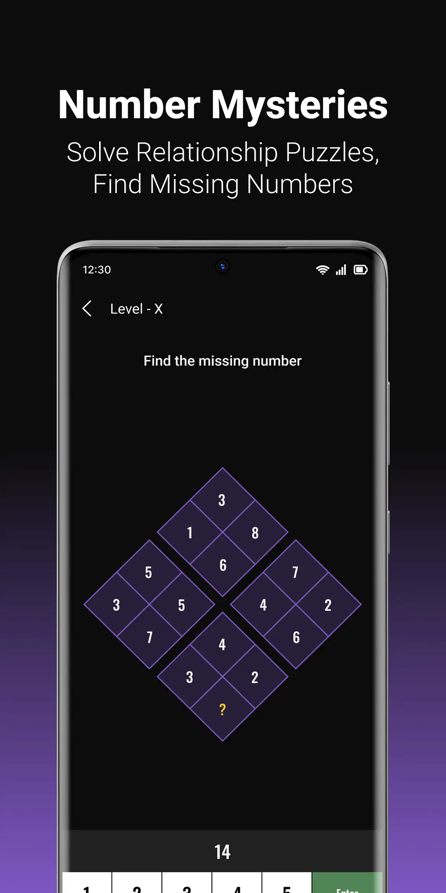

<br />
<p align="center">
  <a href="https://github.com/jaysavsani07/math-metrix">
    
  </a>

  <h3 align="center">Math Riddle : Puzzle & Brain Games</h3>

  <p align="center">
    <a href="https://play.google.com/store/apps/details?id=com.mathgame.riddles.puzzles.brain.teasers"></a>
  </p>
</p>

<h3 align="center">Math Riddles: Boost Your Brainpower with Fun IQ-Enhancing Games!</h3>
<br />

|  |  |  |   |  |  |
|:-------------------------------------------------------------------------------------------:|:---:|:---:|:---:|:---:|:---:|

Welcome to Math Riddle, the ultimate brain workout game designed to elevate your cognitive abilities and keep your mind sharp! With 40+ unique math-based riddles and observation puzzles, challenge your memory, focus, and problem-solving skills. Whether you're looking to improve your IQ or simply have fun, Math Riddle offers an easy-to-use interface and multiple difficulty levels to keep you engaged. Play anytime, anywhere, as the game is fully offline playable. Get ready for an intriguing mental journey that becomes more captivating with each level!

## Game Type
Math Riddle features three different types of games, each offering unique challenges:
```dart
enum GameType {
  numpad,
  option,
  imageOption,
}
```
|  |  |  |   |
|:-------------------------------------------------------------------------------------------:|:---:|:---:|:---:|
| Numpad | Option(abcd) | Option(abcdef) | ImageOption  |


## Puzzle Models
The game is built around a set of models that represent different puzzle levels:
1. **Numpad**:
    - In this type of puzzle, you will be presented with a question or a sequence that requires a numeric answer. Use the virtual numpad to input your solution and proceed to the next level.
    - Its will created with `BaseLevel` class like this
```dart
BaseLevel(
  id: 100,                   //Unique id for this puzzle
  difficulty: 5,             //Currently its not used 
  image: 100.toImagePath(),  //Image path of this puzzle
  answer: "40",              //Numerical answer
)
```
2. **Option**:
    - Test your skills with multiple-choice questions. You'll be given a question along with a set of options, such as (a), (b), (c), (d), or any even number of options. Choose the correct option and move on to the next challenge.
    - Its has predefine `ABCD` option or You can create your custom option like `ABCDEF` or `1,2,3,4` etc.
    - To create an "Option" puzzle, you can use the OptionLevel class like this:
```dart
OptionLevel(
  id: 105,
  difficulty: 5,
  image: 105.toImagePath(),
  answer: "B",              //Answer from below optionList
  optionList: [             // List of options for the puzzle
    const Option(name: "A", isSelected: false),  //isSelected is `false` by default
    const Option(name: "B", isSelected: false),
    const Option(name: "C", isSelected: false),
    const Option(name: "D", isSelected: false),
  ],
)
```
3. **ImageOption**:
    - Engage in image-based puzzles with multiple-choice options. These puzzles include an image along with the corresponding options. Select the correct option based on the image content, and advance through the game.
    - To create an "ImageOption" puzzle, you can use the ImageOptionLevel class like this:
```dart
ImageOptionLevel(
  id: 112,
  difficulty: 5,
  image: 112.toImagePath(),
  answer: "B",                   //Answer from below optionList
  optionList: [                  // List of options for the image-based puzzle
    ImageOption(
      name: "A",                 //Image option(which will cross check with answer)         
      image: 112.toOptionImagePath(type: "a"),//Image option path
    ),
    ImageOption(
      name: "B",
      image: 112.toOptionImagePath(type: "b"),
    ),
    ImageOption(
      name: "C",
      image: 112.toOptionImagePath(type: "c"),
    ),
    ImageOption(
      name: "D",
      image: 112.toOptionImagePath(type: "d"),
    ),
  ],
)
```

<!-- CONTRIBUTING -->
## Contributing

Contributions are what make the open source community such an amazing place to be learn, inspire, and create. Any contributions you make are **greatly appreciated**.

1. Fork the Project
2. Create your Feature Branch (`git checkout -b feature/AmazingFeature`)
3. Commit your Changes (`git commit -m 'Add some AmazingFeature'`)
4. Push to the Branch (`git push origin feature/AmazingFeature`)
5. Open a Pull Request

<!-- CONTACT -->
## Contact

[Nividata Consultancy](https://www.nividata.com/contact/)

## Developer

[Mehul Makwana](https://www.linkedin.com/in/mehul-makwana-430326b9/)

<!-- ACKNOWLEDGEMENTS -->
## This app using following packages

* [provider](https://pub.dev/packages/provider)
* [flutter_hooks](https://pub.dev/packages/flutter_hooks)
* [audioplayers](https://pub.dev/packages/audioplayers)
* [shared_preferences](https://pub.dev/packages/shared_preferences)
* [rxdart](https://pub.dev/packages/rxdart)
* [wakelock](https://pub.dev/packages/wakelock)
* [store_redirect](https://pub.dev/packages/store_redirect)
* [lottie](https://pub.dev/packages/lottie)
* [flutter_animate](https://pub.dev/packages/flutter_animate)
* [go_router](https://pub.dev/packages/go_router)
* [logging](https://pub.dev/packages/logging)
* [collection](https://pub.dev/packages/collection)
* [easy_localization](https://pub.dev/packages/easy_localization)
* [tuple](https://pub.dev/packages/tuple)
* [google_fonts](https://pub.dev/packages/google_fonts)
